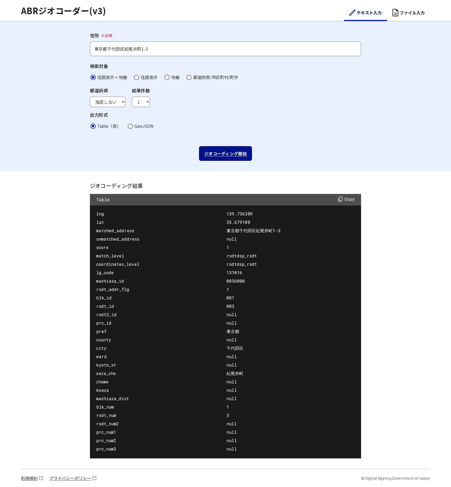

# abr-geocoder-web
デジタル庁 アドレス・ベース・レジストリ ジオコーダー Web UI



## 概要

abr-geocoder-webは、アドレス（住所・所在地）のジオコーディングを行うWeb UIです。
テキスト入力では、ジオコーディング結果をブラウザ上で表示して確認することができます。
ファイル入力では、複数のジオコーディング結果をCSVファイルとしてダウンロードすることができます。

## インデックス
- [abr-geocoder-web](#abr-geocoder-web)
  - [概要](#概要)
  - [インデックス](#インデックス)
  - [使用環境](#使用環境)
  - [ローカルで起動する方法](#ローカルで起動する方法)
  - [使い方](#使い方)
    - [テキスト入力](#テキスト入力)
    - [ファイル入力](#ファイル入力)

-------

## 使用環境

Node: **node.js version 24以上** が必要です。
対象ブラウザ：Google Chrome, Microsoft Edge

## ローカルで起動する方法

1. 本リポジトリをcloneする
2. `npm ci` で依存ライブラリをインストールする
3. [REST API](https://github.com/digital-go-jp/abr-geocoder) をcloneする
4. REST APIを起動する。次のどちらかを選ぶ
   - [クイックスタート](https://github.com/digital-go-jp/abr-geocoder/blob/main/README.ja.md#クイックスタート)：東京都の町字までのテストデータを同梱。`http://localhost:3001` に起動する
   - [全国データ](https://github.com/digital-go-jp/abr-geocoder/blob/main/README.ja.md#全国データ)：住居表示・地番まで扱える。PostgreSQLへの取り込みが必要で、`http://localhost:3000` に起動する
5. `.env.example` を参考に `.env` or `.env.local` ファイルを作成して環境変数を設定する。`NEXT_PUBLIC_API_BASE_URL` は手順4で起動したポートに合わせる
6. 開発モードで実行する `npm run dev`
7. デフォルトでは `http://localhost:8080/` で立ち上がるのでブラウザでアクセスする

## 使い方

### テキスト入力

- `/one-line-geocoding` にアクセス
  - `/one-line-geocoding?address=東京都千代田区紀尾井町1-3`のように`address`パラメータで住所を入力済みにすることも可能
- 住所入力欄に任意の住所を入力する
- 検索対象、都道府県、結果件数、出力形式を指定してジオコーディング開始ボタン押下
  - 検索対象、出力形式については [API仕様](https://redocly.github.io/redoc/?url=https://raw.githubusercontent.com/digital-go-jp/abr-geocoder/main/abrg/openapi/openapi.yml) を参照
  - 都道府県を指定すると、その都道府県だけを検索する。指定しない場合はAPIサーバーの設定に従う
  - 結果件数は1〜5件を指定できる。住所が曖昧な場合は複数の候補が返る
- ジオコーディング結果が指定した検索対象、出力形式で表示される
  - 候補が複数ある場合は候補ごとに区切って表示される
- コピーボタンを押すと、表示されている形式の文字列がクリップボードにコピーされる

### ファイル入力
- `/file-geocoding` にアクセス
- 以下フォーマットのファイルを用意
  - 文字コード：Shift_JIS または UTF-8
  - 改行コード：CR, LF, CR+LF
  - 入力ファイルの例：
    ```
    東京都千代田区紀尾井町1-3
    東京都千代田区永田町1-6-1
    ```
- ファイルを選択して、ジオコーディング開始ボタン押下
- ジオコーディング結果のファイルが表示されるので、ファイルを保存するボタンでダウンロード可能となる
